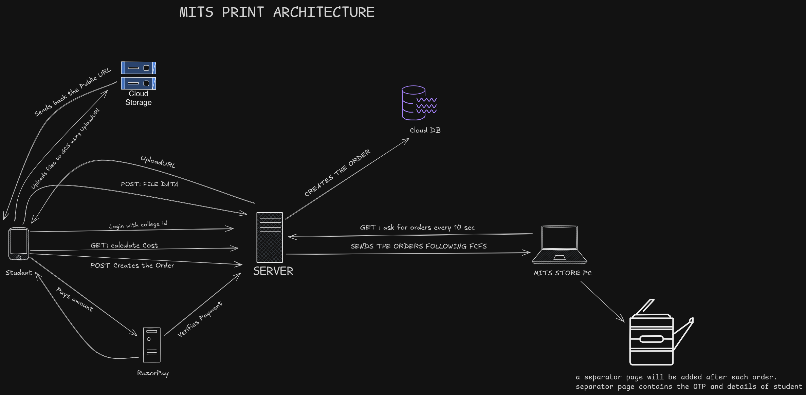
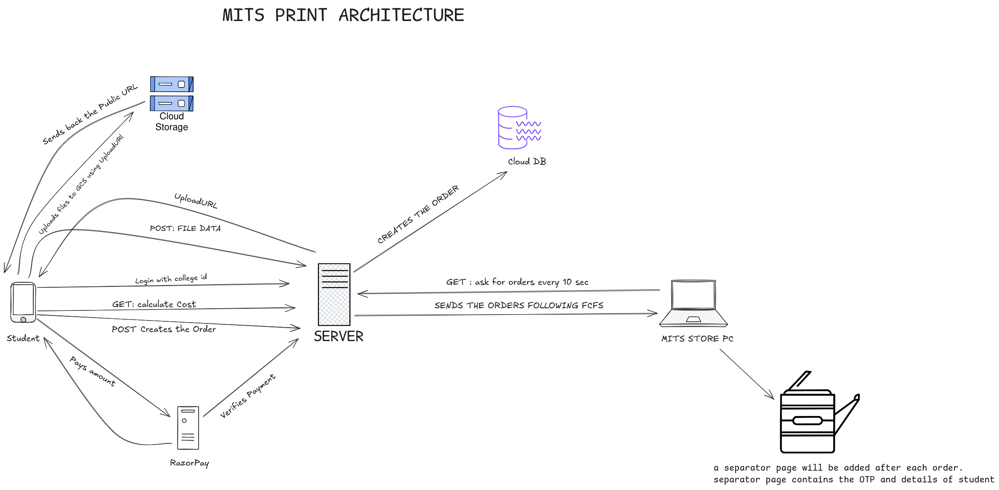

# MITS PRINT
Automated Campus Printing System  
Developer Documentation

---

## 1. Project Overview

MITS PRINT is an automated campus printing platform designed to eliminate long queues and manual print handling in the MITS store during lab record submissions and semester endings.

Students upload documents, pay online, and receive printed output automatically without interacting with printer. Print jobs are queued, stored, processed, and printed by a dedicated printer PC running a background Python service.

---

## 2. System Architecture




The system is composed of five major components:

1. **Next.js Web Application**
2. **Backend API (Next.js API Routes)**
3. **PostgreSQL Database (Prisma ORM)**
4. **Google Cloud Storage (GCS)**
5. **Store Printer PC (Python Print Agent)**


---

## 3. Authentication & Security

Authentication is handled using:

- NextAuth
- JWT tokens
- bcrypt password hashing

Only users with a valid college email (`@mgits.ac.in`) can register and log in.

Authentication Flow:
1. User logs in using college email
2. JWT is issued
3. Token is used for all order and payment requests

---

## 4. Print Order Lifecycle

1. Student logs in
2. Uploads PDF files
3. Selects print settings
4. Makes payment via Razorpay
5. Files are uploaded to Google Cloud Storage
6. File URLs are stored in the database
7. Order status becomes `PENDING`
8. Printer PC fetches orders every 10 seconds
9. Print jobs are downloaded and printed
10. Status becomes `PRINTED`

---

## 5. Data Model

### Order Object

```json
{
  "id": "cmk4wxual00008letzam0df3c",
  "otpCode": "17207",
  "status": "PENDING",
  "studentId": "dkufwifgwfgwgw",
  "createdAt": "2026-01-08T03:54:08.061Z",
  "prints": [
    {
      "id": "cmk4wxuda00018lettecj9ajl",
      "fileUrl": "https://storage.googleapis.com/mits-print-bucket/pdfs/06a6d8a7-8924-471d-afff-2d14cbf367e6.pdf",
      "copies": 1,
      "colorMode": "BLACK_WHITE",
      "orientation": "PORTRAIT",
      "printOnBothSides": false,
      "pageRange": "ALL",
      "customRange": null
    }
  ],
  "student": {
    "id": "dkufwifgwfgwgw",
    "email": "mail@mgits.ac.in",
    "name": "John Smith"
  }
}
```

## Conclusion

MITS PRINT transforms a traditionally manual, crowded, and error-prone printing process into a fully automated, secure, and scalable digital workflow. By combining cloud storage, online payments, real-time job queuing, and an on-premise printer execution service, the system eliminates long queues, reduces staff workload, and ensures that every print job is traceable, paid for, and correctly fulfilled.

The architecture separates user interaction, business logic, file storage, and physical printing into independent components, allowing the system to remain reliable even under high demand during lab submissions and semester endings. With proper authentication, payment verification, and job tracking, the platform guarantees that only authorized and paid print requests reach the printers.

This system is designed not only to solve the current needs of the MITS store, but also to scale for future expansion, including multiple printers, enhanced monitoring, and advanced queue management. With its modular design and modern technology stack, MITS PRINT provides a strong foundation for a fully digital campus printing infrastructure.

---
